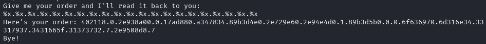

# Format String 1
### Binex, 100 points

> Patrick and Sponge Bob were really happy with those orders you made for them, but now they're curious about the secret menu. Find it, and along the way, maybe you'll find something else of interest! <br>
>
>**Hint 1:** https://lettieri.iet.unipi.it/hacking/format-strings.pdf <br>
>**Hint 2:** Is this a 32-bit or 64-bit binary?

We're given a source file and executable. 

Checking out the source file, it looks like first we allocate space for "secret-menu-item-1", then "flag.txt", then "secret-menu-item-2". Then, it's a pretty typical, "type something in, get something back" challenge, the caveat being there's an extra obstacle to account for (secret-menu-item-2). 

The general idea of the format string exploit is as ever: use the "%" formatting to read data from memory, in this case, the flag. 

Now, admittedly I'm no binex *savant*, so after watching [this video](https://www.youtube.com/watch?v=DhVRI33s-D0), I figured I'd just replicate the process (tl;dr): inputting "%x" over and over, separated by some delimeter (".") and analyzing the outputs.

Let's try it!



Now we have some hex values, let's (with some help from GPT) write a quick python script to decode it, accounting for the endianness:

```python
hex_values = input().split('.')
strings = []
for hex_val in hex_values:
    try:
        strings.append(bytes.fromhex(hex_val).decode('utf-8')[::-1])
    except ValueError:
        continue
print(strings)
```

The basic premise here is to take in the outputted hex values we read from memory (which we specified with "%x"), and attempt to convert them into something we can read, reversed (`[::-1]`) to account for endianness. 

Here's what we get:


So close! Although we can see the first part, and what looks like different parts of the flag, we're not quite getting the full thing. So, I decided to try the same thing but input "%llx" repeating, to get larger output ("long long").

Sure enough, this gets us our secret recipe: the flag!


`picoCTF{4n1m41_57y13_4x4_f14g_64277116}`
