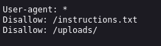
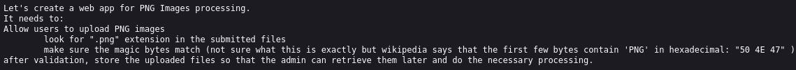
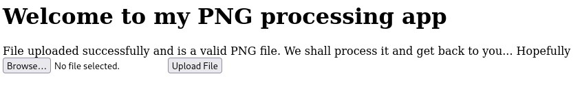

# Trickster
### Web, 300 points

> I found a web app that can help process images: PNG images only!
>
> *There are no hints for this challenge.*

By sheer luck, I had recently solved a similar problem on RPISEC's fairgame challenge suite, and as such I was familiar with the basic premise. 

We can exploit the website's file upload capabilities by inserting a webshell. More info [here](https://d00mfist.gitbooks.io/ctf/content/bypass_image_upload.html), among other places.

I started out by downloading a [PHP Webshell](https://gist.github.com/joswr1ght/22f40787de19d80d110b37fb79ac3985) (on a virtual machine! Your host may delete this file; the link is to a github gist, not a download), 
and now all we have to do is bypass the restriction to PNGs, as uploading the raw .php file is blocked.

However, simply renaming the file still doesn't let us upload! Rude. 

So how else would we know what's a PNG? We'll likely have to change the actual header of the file-this was later confirmed after running [DirBuster](https://www.kali.org/tools/dirbuster/) on the website, revealing the existence of `robots.txt`!

We'll return to `uploads` momentarily, but for now, let's check out `instructions.txt`. 

So to bypass the restriction, we have to have ".png" in our file name, and have a file header beginning with `50 4E 47`, for PNG. Changing the header can be done in any hex editor.

Additionally, let's name our file `name.png.php`, since the website will only check for the existence of ".png" in the name-this will allow us to access the file as a .php, allowing our webshell to work correctly.

Once we've got our webshell with a changed header and name, let's upload!

Success! So, what now? Now, let's attempt to access our file in `uploads`:

Looks like the webshell has activated! Although it appears we can't exit our directory, we can inspect the contents of other directories in our file path with `ls` and `pwd` to get our directory.

In the directory right above us, there's a strange txt file named with random characters. Using `cat` on this file gives us our flag.

`picoCTF{c3rt!fi3d_Xp3rt_tr1ckst3r_03d1d548}`
