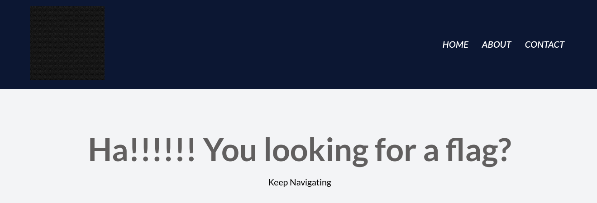

# WebDecode
### Web, 50 points

> Do you know how to use the web inspector? <br>
> 
> **Hint 1:** Use the web inspector on other files included by the web page. <br>
> **Hint 2:** The flag may or may not be encoded

The challenge description and low point value indicates this is an inspect element challenge.

Inspecting the landing page doesn't seem to yield anything immediately, and the website hints to "keep navigating", so I visited the "ABOUT" and "CONTACT" pages.



When inspecting the "ABOUT" page, the long string of characters in `notify_true` looks promising.
```html
  <section class="about" notify_true="cGljb0NURnt3ZWJfc3VjYzNzc2Z1bGx5X2QzYzBkZWRfZjZmNmI3OGF9">
   <h1>
    Try inspecting the page!! You might find it there
   </h1>
   <!-- .about-container -->
  </section>
```

and indeed putting the string into a base64 decoder yields the flag. <br>
`picoCTF{web_succ3ssfully_d3c0ded_f6f6b78a}`
