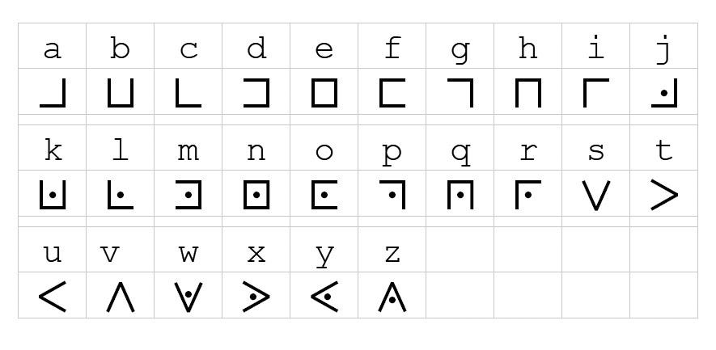
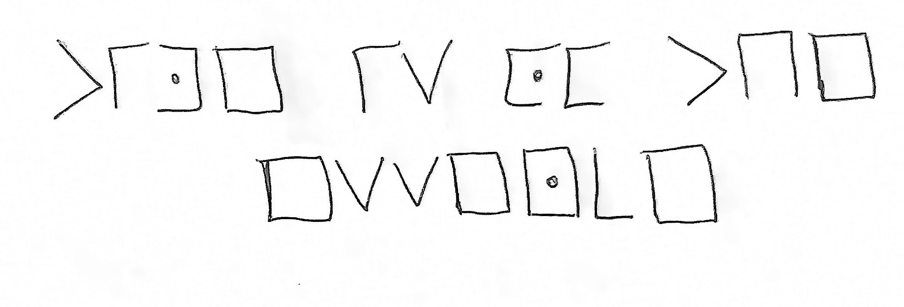

# Words
### Crypto 100 \[Warmups\]

#### Description
> X marks the spot, but not where the Pigpen lies; there, secrets hide in plain sight.

The description gives the challenge away, the picture represents a pigpen cipher, which when first coming across the challenge I searched up "cipher with lines". 

Using this to decode the image, we get the flag and wrap it in RS{}.

RS{time_is_of_the_essence}